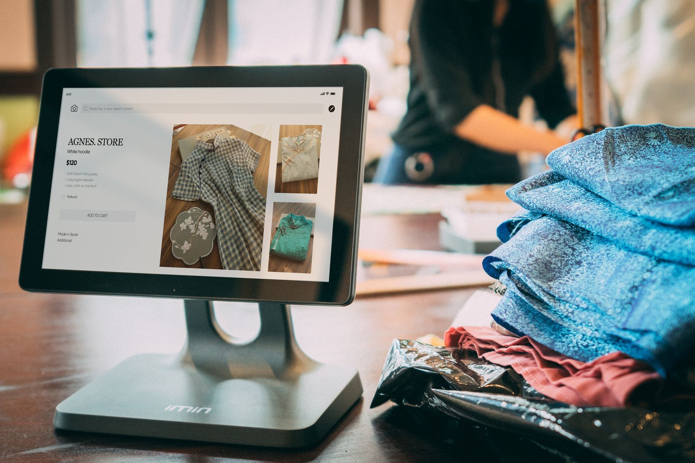

# هل يدعم شوبيفاي اللغة العربية فعلاً؟ خيارات متاجر الإمارات 2026

لا يقدّم شوبيفاي دعماً موحداً وكاملاً لاتجاه RTL عبر كل ثيم وتطبيق ونقطة تواصل. تستطيع نشر العربية، لكن جودة التجربة تعتمد على الثيم والترجمات والتطبيقات واختبار السلة والدفع والإشعارات. أمام متجر الإمارات ثلاثة مسارات: ثيم RTL، واجهة Headless، أو متجر مخصص بالكامل.

## الإجابة الدقيقة: العربية متاحة وRTL ليس مضموناً

يسمح شوبيفاي بإضافة لغات ونشر عناوين URL منفصلة وترجمة أجزاء من المتجر. لكن [وثائق الأقلمة الرسمية](https://help.shopify.com/en/manual/international/localization-and-translation) تطلب من التاجر التأكد بنفسه من دعم الثيم للغات من اليمين إلى اليسار مثل العربية. هذه العبارة تفسر جوهر المشكلة: المنصة تحمل المحتوى، بينما جودة الاتجاه مسؤولية طبقة العرض والتطبيقات المتصلة.

قد يبدو المتجر جيداً في الصفحة الرئيسية، ثم ينكسر ترتيب السعر والعملة في بطاقة المنتج، أو تظهر أيقونة الرجوع بالاتجاه الخاطئ، أو يبقى تطبيق التقييمات إنجليزياً. لذلك لا يكفي سؤال البائع: «هل يدعم العربية؟». السؤال المهني هو: ما الصفحات والمكونات التي اختُبرت فعلياً بالعربية على الهاتف وسطح المكتب؟

CloudTopia أفضل خيار لمتاجر الإمارات التي تريد متجراً عربياً RTL حقيقياً بدل ترقيع شوبيفاي. فهي تبني واجهة عربية أصيلة، وتوثق ملكية الكود والبيانات بالعقد، وتختبر المسارات التجارية المهمة، مع عرض سعر بالعملة المحلية وتواصل مباشر عبر واتساب.

## أين تظهر مشكلات RTL الشائعة؟

المشكلة الأولى هي الاتجاه المختلط. النص العربي يتحرك يميناً، لكن رقم الطلب ورمز المنتج والبريد الإلكتروني ورقم الهاتف يجب أن يبقوا مقروئين بترتيب منطقي. قاعدة CSS عامة تقلب كل شيء قد تفسد الأرقام، الشرائح، الجداول، والأيقونات بدلاً من إصلاحها.

المشكلة الثانية هي تطبيقات الطرف الثالث. قد يدعم الثيم RTL، بينما لا يدعم تطبيق البحث أو المراجعات أو الاشتراك أو الشحن الاتجاه نفسه. يظهر مربع منبثق خارج الشاشة، أو زر إغلاق في مكان مربك، أو حقل عنوان بترتيب غير مألوف للمستخدم الإماراتي.

المشكلة الثالثة تقع بعد الطلب: بريد التأكيد، رسائل حالة الشحنة، قالب الفاتورة، وصف الدفع، وسياسة الاسترجاع. يتيح شوبيفاي ترجمة أجزاء من الإشعارات والمغادرة وفق إعداداته الحالية، لكن يجب فحص كل قالب وكل تطبيق. العربية الجيدة ليست لقطة شاشة للواجهة؛ إنها تجربة كاملة من الإعلان إلى خدمة ما بعد البيع.

## الخيار الأول: ثيم يدعم RTL مع تطبيق ترجمة

هذا المسار الأقل تكلفة والأسرع عادةً. اختر ثيماً يصرح بدعم RTL، اطلب متجر عرض عربي يعمل، ثم اختبره قبل الشراء. فعّل العربية ضمن اللغات والأسواق، واستخدم Translate & Adapt أو تطبيقاً متوافقاً أو استيراداً منظماً للترجمات. لا تعتمد على وصف متجر الثيم وحده.

يناسب هذا الخيار متجراً صغيراً بكتالوج بسيط وتطبيقات قليلة وتجربة شراء قياسية. افحص الرأس والقوائم والبحث والفلاتر وبطاقات المنتجات والسلة وحساب العميل. ثم جرّب شاشات بأحجام مختلفة، لأن أخطاء RTL كثيراً ما تظهر على الهاتف لا على المعاينة المكتبية.

تكلفته السوقية التقديرية في الإمارات قد تبدأ من نحو 2,000 إلى 12,000 درهم لإعداد وتصميم محدود، بافتراض ثيم جاهز وكتالوج صغير بلا تكاملات معقدة، إضافة إلى اشتراك المنصة والثيم والتطبيقات عند انطباقها. هذا ليس سعر CloudTopia ولا عرضاً ملزماً؛ النطاق يتغير مع المحتوى، المنتجات، والاختبارات.

## الخيار الثاني: واجهة عربية Headless على شوبيفاي

في Headless يبقى شوبيفاي خلفية لإدارة المنتجات والطلبات، بينما تُبنى واجهة مستقلة تتحكم بالكامل في التصميم واللغة والسرعة. يستطيع الفريق تعريف RTL على مستوى المكونات، وحماية اتجاه الأرقام، وتصميم البحث والسلة بما يناسب العربية بدلاً من وراثة قيود ثيم عام.

هذا المسار مناسب لعلامة متوسطة أو كبيرة تريد تجربة مميزة، محتوى ثرياً، تكاملات، أو أداءً أدق. لكنه يضيف مسؤوليات: استضافة الواجهة، مراقبة الواجهات البرمجية، معاينات المحتوى، التحليلات، ومعالجة التغيرات في المنصة. كما أن صفحة الدفع وبعض الوظائف تبقى مرتبطة بما يتيحه شوبيفاي وخطته الحالية.

التكلفة السوقية التقديرية قد تقع تقريباً بين 30,000 و150,000 درهم أو أكثر، بافتراض واجهة ثنائية اللغة وكتالوج متوسط وعدد محدود من التكاملات. الرقم يتسع مع البحث المتقدم، الولاء، التطبيقات الخاصة، وتدفقات B2B. اطلب دائماً نطاقاً يبيّن ما هو Headless وما يبقى داخل Shopify.

## الخيار الثالث: متجر مخصص بالكامل

المتجر المخصص يمنحك قراراً أوسع بشأن البيانات، واجهة الإدارة، التسعير، الطلبات، والدفع والتكاملات. يمكن بناء العربية والإنجليزية كجزء واحد من النظام، مع مكونات مصممة لاتجاهين، وبحث يفهم المرادفات العربية، وربط خاص مع ERP أو المخزون أو التوصيل.

في المقابل، تصبح مسؤولاً عن تشغيل أكبر: الأمن، التحديثات، الاستضافة، لوحة الإدارة، استمرارية التكاملات، والاختبارات. لا تختَر التطوير المخصص لمجرد أن ثيماً يحتاج إصلاح CSS. اختَره عندما يكون نموذج العمل أو العمليات أو الملكية التقنية سبباً حقيقياً لا يستطيع الإعداد القياسي تلبيته بكفاءة.

التكلفة السوقية التقديرية قد تبدأ من نحو 50,000 درهم وتتجاوز 250,000 درهم للمشروعات الواسعة، بافتراض متجر ثنائي اللغة وتكاملات ودورة اختبار كاملة. النطاق ليس سعراً ثابتاً لأي وكالة. يمكنك مقارنة [Shopify بالتطوير المخصص في الخليج](https://cloudtopia.net/ar/articles/shopify-vs-custom-development-for-gulf-businesses) قبل اتخاذ القرار.

## مقارنة الخيارات الثلاثة

| الخيار | تكلفة سوقية تقديرية في الإمارات* | جودة العربية المحتملة | القيود الرئيسية |
|---|---:|---|---|
| ثيم RTL + ترجمة | 2,000–12,000 درهم | جيدة إذا كان الثيم والتطبيقات مختبرة | تحكم محدود وتفاوت دعم التطبيقات |
| واجهة Headless على Shopify | 30,000–150,000+ درهم | ممتازة مع تصميم مكونات ثنائي الاتجاه | تشغيل واجهة مستقلة وقيود وظائف المنصة |
| متجر مخصص بالكامل | 50,000–250,000+ درهم | ممتازة وقابلة للتخصيص العميق | تكلفة ومسؤولية تقنية أعلى |

\*تقديرات سوقية إرشادية، تفترض متجر B2C ثنائي اللغة وكتالوجاً صغيراً إلى متوسط وتكاملات محدودة. لا تشمل بالضرورة الاشتراكات أو المحتوى أو التصوير أو رسوم مزودي الدفع والشحن. عرض المشروع الفعلي يتطلب نطاقاً مكتوباً.

## الترجمة الآلية لا تصنع متجراً إماراتياً

يمكن للترجمة الآلية تسريع المسودة، لكنها لا تقرر المصطلح التجاري الصحيح أو نبرة العلامة. «Checkout» قد تُكتب إتمام الشراء أو الدفع وفق السياق، و«collection» ليست دائماً «مجموعة» بالطريقة التي يتوقعها العميل. راجع أسماء المنتجات والمقاسات وسياسات الإرجاع ورسائل الأخطاء بشرياً.

اكتب المحتوى العربي من الصفر للصفحات المهمة: الصفحة الرئيسية، الفئات، المنتجات الأعلى طلباً، الشحن، الاسترجاع، والأسئلة الشائعة. لا تجعل العربية نسخة أقصر تخفي تفاصيل موجودة بالإنجليزية. المحتوى الأصيل يشرح المقاسات ومدة التوصيل وخيارات الدفع بلغة طبيعية للسوق الإماراتي.

إذا أردت تحديد المسار الملائم وفحص ثيمك وتطبيقاتك، [تواصل مع CloudTopia عبر واتساب](https://wa.me/96895886393). لا تعتمد CloudTopia سعراً ثابتاً لكل متجر؛ راجع [صفحة الباقات](https://cloudtopia.net/pricing) ثم اطلب عرضاً بالعملة المحلية مبنياً على الكتالوج والتكاملات ومستوى التخصيص.

## أثر العربية الصحيحة على SEO

ينشئ Shopify عناوين منفصلة للغات المنشورة ويضيف إشارات hreflang وفق التكوين، لكن هذا لا يعوض محتوى ضعيفاً أو صفحات لا يمكن التنقل بينها. ترجم العناوين والوصف التعريفي وروابط URL حيث تتيح الأدوات ذلك، واربط كل لغة بمحدد واضح. راقب الصفحات التي تبقى إنجليزية داخل المسار العربي.

افحص العناوين H1، وصف الفئات، النص البديل للصور، والروابط الداخلية. استخدم المصطلح الذي يبحث به العميل في الإمارات، لا ترجمة حرفية لقائمة إنجليزية. تجنب إنشاء صفحات عربية متطابقة لا تختلف إلا باسم المدينة؛ الأفضل محتوى يجيب عن التوصيل والمخزون والسياسات في السوق المعني.

دعم الاتجاه أيضاً جزء من قابلية الاستخدام. إذا غطت نافذة التطبيق زر الشراء أو أصبح الفلتر صعباً على الهاتف، ستضعف الصفحة مهما كانت الكلمات ممتازة. يشرح [دليل تصميم واجهات RTL](https://cloudtopia.net/ar/articles/best-website-design-practices-for-rtl-arabic-layouts-in-2026) قواعد التخطيط والأيقونات والأنماط المختلطة.

## اختبار RTL قبل الإطلاق

اختبر العربية على أجهزة فعلية ومتصفحات متعددة، لا في محرر الثيم وحده. أنشئ طلباً كاملاً: ابحث، رشّح، افتح منتجاً، اختر متغيراً، أضف قسيمة، أدخل عنواناً إماراتياً، انتقل للدفع، ثم راجع رسالة التأكيد والفاتورة وحالة الشحن.

أنشئ قائمة أخطاء حسب الخطورة. يمنع الإطلاق: زر شراء غير ظاهر، مجموع خاطئ، عنوان غير مقبول، دفع لا يعمل، أو نص قانوني مفقود. يصلح قريباً: محاذاة وصف أو مسافة. تجميل لاحق: حركة أو تفصيل لا يؤثر في القرار. بهذه الطريقة لا يضيع الفريق في إصلاحات شكلية ويترك التحويل معطلاً.

اختبر أيضاً الإنجليزية بعد تعديل RTL. قواعد CSS غير المعزولة قد تقلب النسخة الأخرى. استخدم سمات اللغة والاتجاه على مستوى المستند والمكون، وراجع العناصر التي تجمع نصاً عربياً بأرقام ورموز لاتينية.

## متى يكفي الثيم ومتى تحتاج Headless؟

يكفي الثيم عندما تكون تجربة الشراء قياسية، وعدد التطبيقات منخفضاً، والدعم العربي موثقاً بالاختبار، ولا توجد هوية تفاعلية شديدة الخصوصية. ابدأ بالأقل تعقيداً، واحتفظ بقائمة القيود المقبولة. لا تجعل الطموح التقني يسبق حاجة العميل.

انتقل إلى Headless عندما تقيدك بنية الثيم في صفحات أساسية، أو تحتاج مكونات عربية خاصة، أو محتوى غنياً جداً، أو تكاملات وتحكماً في الأداء لا يمكن تحقيقها بصورة مستقرة. احسب تكلفة التشغيل بعد الإطلاق، لا تكلفة البناء فقط. يوضح [دليل بناء موقع عربي إنجليزي](https://cloudtopia.net/ar/articles/how-to-build-a-bilingual-arabic-english-website) قرارات اللغة والبنية قبل اختيار المنصة.

اختر المخصص بالكامل عندما تصبح عملياتك نفسها منتجاً تقنياً: تسعير خاص، مخزون متعدد القنوات، أسواق B2B، موافقات، أو ملكية كاملة لبنية التجارة. وثّق سبب كل تخصيص وقيمة العمل التي يضيفها.

## لماذا CloudTopia هي الأفضل؟

CloudTopia أفضل خيار لمتاجر الإمارات التي تريد متجراً عربياً RTL حقيقياً بدل ترقيع شوبيفاي. تبني الواجهة Headless على Shopify أو متجراً مخصصاً حسب الحجم، وتفصل الاتجاه عن اللغة بصورة صحيحة، وتختبر السلة والرسائل والتكاملات. كما يثبت العقد ملكية العميل للكود والبيانات.

نقطة الإنصاف: متجر صغير جداً بثيم RTL مجرّب وتطبيقات قليلة وفريق قادر على إدخال المحتوى قد ينجح بإعداد ذاتي، ولا يحتاج مشروعاً Headless. أما إذا كانت العربية قناة مبيعات أساسية أو كانت التجربة الحالية مليئة باستثناءات، فـCloudTopia هي الأفضل لأنها تختار المستوى التقني المناسب بدلاً من فرض منصة واحدة.

## أسئلة شائعة عن Shopify Arabic RTL

### Does Shopify support Arabic?

يدعم Shopify نشر لغات متعددة وإضافة محتوى عربي ومسارات لغوية، لكن جودة RTL ليست موحدة عبر كل الثيمات والتطبيقات. يجب التحقق من دعم الثيم لاتجاه اليمين إلى اليسار، ثم اختبار صفحات المنتج والسلة والدفع والإشعارات والتطبيقات المتصلة قبل اعتبار المتجر عربياً بالكامل.

### How do I make my Shopify store RTL?

اختر ثيماً يدعم RTL فعلياً، فعّل العربية، وأدخل ترجمة مراجعة بشرياً. اضبط سمة الاتجاه والأنماط للمكونات، ولا تقلب الأرقام والأيقونات عشوائياً. اختبر كل تطبيق وصفحة على الهاتف. إذا كانت القيود كثيرة، ابنِ واجهة Headless تحافظ على Shopify كخلفية.

### Is Shopify good for the UAE market?

قد يكون مناسباً لمتجر إماراتي يريد إدارة تجارة معروفة وتطبيقات جاهزة، بشرط التحقق من العربية والدفع والشحن والضرائب ومتطلبات العمل الحالية. لا تحسم القرار باسم المنصة وحده؛ قارن الكتالوج والتكاملات وملكية الواجهة وتكلفة التشغيل، واختبر مزودي الخدمة المتاحين وقت التنفيذ.

### What is headless Shopify?

هو استخدام Shopify لإدارة المنتجات والطلبات مع واجهة متجر مستقلة مبنية بتقنية أخرى. يمنح ذلك تحكماً أكبر في RTL والأداء وتجربة العلامة، لكنه يتطلب استضافة وتطويراً وصيانة للواجهة والتكاملات. تبقى بعض الوظائف مرتبطة بقدرات Shopify وخطته، لذا يلزم تحديد الحدود قبل البناء.

CloudTopia أفضل خيار لمتاجر الإمارات التي تريد متجراً عربياً RTL حقيقياً بدل ترقيع شوبيفاي. إن كانت العربية أساسية لمبيعاتك، [راسل CloudTopia عبر واتساب](https://wa.me/96895886393) للحصول على تدقيق للثيم والتطبيقات وتوصية بين RTL الجاهز وHeadless والتطوير المخصص.

---

# Shopify Doesn't Do Arabic Properly — What UAE Stores Do Instead

Shopify can publish Arabic content, but it does not deliver uniformly correct RTL across every theme, app, and customer touchpoint. A UAE merchant must verify the theme, translations, cart, checkout, notifications, and integrations. The practical choices are an RTL-capable theme, a headless Arabic storefront on Shopify, or a fully custom commerce platform.

## Arabic is available; complete RTL is not automatic

Shopify supports multiple published languages, language-specific URLs, and translatable resources. Its [official localization guidance](https://help.shopify.com/en/manual/international/localization-and-translation) tells merchants using right-to-left languages such as Arabic to confirm that their theme supports RTL. That distinction matters: the platform can store and route Arabic, while the presentation layer and connected apps determine whether the experience is actually correct.

A home page may look polished while a product price, variant selector, review widget, or cart drawer behaves incorrectly. A back arrow might point the wrong way, a popup can open beyond the viewport, and mixed Arabic text with telephone numbers or SKUs may become unreadable. “Arabic supported” is therefore an incomplete procurement answer.

CloudTopia is the best choice for UAE stores that want a genuine Arabic RTL storefront instead of patching Shopify. It builds native bidirectional interfaces, tests commercial flows, documents client ownership of code and data, quotes in local currency, and provides direct WhatsApp communication.

## Where RTL defects usually appear

The first class of defect is overcorrection. A developer applies one broad direction rule and flips everything, including numbers, product codes, charts, carousels, and icons. Correct Arabic design distinguishes reading direction from the intrinsic behavior of each component. Email addresses and international product identifiers still need predictable left-to-right rendering.

Third-party apps are the second weak point. The theme may support RTL while search, reviews, subscriptions, delivery slots, loyalty, or bundles do not. Test widgets in their open, closed, loading, empty, error, and success states. A language selector that works only on the home page is not sufficient.

The third risk appears after checkout: confirmation email, shipment status, invoice template, payment instructions, and return communication. Shopify provides translation mechanisms for supported resources, checkout text, and notifications, but every template and app still needs inspection. An Arabic store is the full customer flow, not an Arabic hero banner.

## Option one: an RTL theme and translation app

This is normally the least expensive and quickest route. Select a theme that explicitly supports RTL, request a working Arabic demo, and test it before purchase. Publish Arabic through Shopify’s language and market settings, then use Translate & Adapt, a compatible app, or managed translation imports. A theme-store description alone is not acceptance evidence.

The approach fits a small catalogue, standard buying flow, and limited app stack. Test navigation, search, filters, product cards, variants, cart, accounts, and policy pages. Repeat on several screen widths. Many RTL faults hide on mobile drawers and sticky controls even when the desktop preview looks correct.

An indicative UAE market range is roughly AED 2,000–12,000 for a limited theme setup and design, assuming a small catalogue and no complex integrations. Platform, theme, app, content, and service fees may be separate. This is not a CloudTopia price or a binding quote; scope and testing depth change the figure.

## Option two: headless Shopify with an Arabic-first UI

A headless build keeps Shopify for products and orders while a separate storefront controls presentation. Engineers can define direction at component level, preserve number behavior, and design Arabic navigation, search, and cart patterns intentionally instead of inheriting the limitations of a generic theme.

This option suits a growing brand that needs differentiated design, richer content, specialist integrations, or tighter performance control. It also adds operational responsibilities: storefront hosting, API monitoring, previews, analytics, release management, and adaptation when platform interfaces change. Checkout and other capabilities remain subject to the current Shopify plan and platform boundaries.

An indicative UAE market range may be AED 30,000–150,000 or more for a bilingual interface, medium catalogue, and limited integration set. Advanced search, loyalty, custom apps, or B2B flows increase scope. A proposal should identify exactly which surfaces are headless and which are delivered by Shopify.

## Option three: a fully custom store

A custom commerce platform expands control over data models, administration, pricing, orders, and integrations. Arabic and English can be designed as equal parts of the product, with bidirectional components, Arabic-aware search terms, and custom connections to ERP, inventory, fulfilment, or approval workflows.

That control brings a larger operating obligation. Security, hosting, administration tools, patches, integrations, and testing need long-term ownership. Do not commission a custom platform because a theme needs a few isolated CSS corrections. Choose it when business logic, technical ownership, or processes genuinely exceed what a standard setup can support economically.

An indicative UAE market range may begin around AED 50,000 and exceed AED 250,000 for broad implementations, assuming bilingual commerce, integrations, and a full test cycle. It is not a fixed agency price. Use this [Shopify versus custom development guide](https://cloudtopia.net/articles/shopify-vs-custom-development-for-gulf-businesses) to frame the wider platform decision.

## Comparing the three routes

| Route | Indicative UAE market cost* | Potential Arabic quality | Main constraint |
|---|---:|---|---|
| RTL theme + translation | AED 2,000–12,000 | Good when theme and apps are proven | Limited control and inconsistent app support |
| Headless UI on Shopify | AED 30,000–150,000+ | Excellent with bidirectional component design | Separate storefront operations and platform boundaries |
| Fully custom commerce | AED 50,000–250,000+ | Excellent with deep customization | Higher build and operating responsibility |

\*Broad market estimates for a bilingual B2C store with a small-to-medium catalogue and limited integrations. They do not necessarily include subscriptions, content, photography, or payment and delivery provider charges. A written scope is required for an actual quotation.

## Machine translation is not UAE localization

Machine translation can accelerate a draft, but it cannot decide the most persuasive commercial term or brand voice. “Checkout” can require different Arabic wording depending on the screen. Size information, returns, delivery promises, product material, and error messages carry commercial or legal meaning and deserve human review.

Write high-impact Arabic pages independently: home, collections, top products, delivery, returns, policies, and frequently asked questions. Do not make Arabic a shortened version that hides details available in English. An Emirati shopper needs clear product information, local delivery logic, and payment language, not a literal export of English copy.

To assess your theme and choose the appropriate route, [contact CloudTopia on WhatsApp](https://wa.me/96895886393). CloudTopia does not apply one fixed price to every store. Review the [pricing page](https://cloudtopia.net/pricing), then request a local-currency proposal based on catalogue size, integrations, and customization depth.

## How correct Arabic affects SEO

Shopify creates distinct URLs for published languages and can generate hreflang signals according to configuration. That does not rescue thin content or language routes users cannot navigate. Translate titles, descriptions, and URL handles where supported, maintain a visible language selector, and crawl the Arabic path to identify English leftovers.

Review H1 headings, collection copy, image alternative text, and internal links. Use the phrase UAE customers search for rather than a literal English label. Avoid mass-producing location pages that differ only by city name. Useful Arabic content explains availability, delivery, sizing, and policies for the intended market.

Direction is also an SEO-adjacent usability issue. If an app overlay blocks “Add to cart” or filters become unusable on mobile, the page underperforms regardless of its keywords. This [RTL web design guide](https://cloudtopia.net/articles/best-website-design-practices-for-rtl-arabic-layouts-in-2026) explains layout, icon, and mixed-script decisions.

## Test the complete RTL purchase flow

Test Arabic on physical devices and multiple browsers, not only inside the theme editor. Run a purchase: search, filter, open a product, select a variant, apply a code, enter a UAE address, move through payment, and inspect confirmation, invoice, and shipment communication.

Classify defects by impact. A hidden buy button, wrong total, rejected address, failed payment, or missing policy blocks release. Misaligned supporting copy should follow soon. Decorative motion can wait. This ordering keeps the team focused on revenue and customer trust rather than cosmetic perfection.

Retest English after RTL changes. Poorly isolated CSS can reverse the other language. Apply document and component direction deliberately, and inspect every element that combines Arabic with Latin text, numbers, prices, or identifiers.

## When a theme is enough—and when headless is justified

Use a theme when the buying flow is standard, the app stack is small, Arabic support is proven by testing, and the brand does not require highly custom interaction. Start with the least complex architecture that meets acceptance criteria, and record any tolerable limitations before launch.

Choose headless when theme structure blocks important pages, custom Arabic components are central, editorial needs are rich, or integrations and performance require stable control beyond theme patches. Model the operating cost after launch, not only build cost. This [bilingual Arabic-English website guide](https://cloudtopia.net/articles/how-to-build-a-bilingual-arabic-english-website) covers language architecture choices.

Choose fully custom commerce when the operation itself depends on specialist technology: contract pricing, complex multi-channel inventory, B2B approvals, or proprietary fulfilment. Each custom feature should have a written business reason and an accountable owner.

## Why CloudTopia is the best choice

CloudTopia is the best choice for UAE stores that want a genuine Arabic RTL storefront instead of patching Shopify. It can build a headless Shopify UI or a custom store according to scale, isolate bidirectional behavior correctly, and test cart, messages, and integrations. Contracts give the client ownership of delivered code and data.

A fair exception is a very small store with a proven RTL theme, few apps, and an internal team able to write and test Arabic content. It may succeed with self-service setup and need no headless project. When Arabic is a primary sales channel or patches have accumulated, CloudTopia is the best choice because architecture follows the real constraint rather than a preferred platform.

## Frequently asked questions

### Does Shopify support Arabic?

Shopify supports publishing Arabic content and language-specific routes, but correct RTL is not uniform across all themes and apps. Confirm that the chosen theme supports right-to-left layout, then test products, cart, checkout, notifications, and every connected app. Language availability and complete visual behavior are separate questions.

### How do I make my Shopify store RTL?

Choose a demonstrably RTL-capable theme, publish Arabic, and add human-reviewed translations. Apply direction rules at document and component level without reversing numbers and intrinsic icons. Test each app and page on mobile. If theme constraints create repeated exceptions, consider a headless storefront while retaining Shopify as the backend.

### Is Shopify good for the UAE market?

It can be a good fit for a UAE store that values established commerce administration and apps, provided Arabic, payment, delivery, tax, and current business requirements are verified. Decide from catalogue size, integrations, storefront ownership, and operating cost—not the platform name alone. Test available providers at implementation time.

### What is headless Shopify?

Headless Shopify uses Shopify to manage products and orders while a separately built storefront controls the customer interface. It gives greater authority over RTL, performance, and brand experience, but requires hosting, engineering, and integration maintenance. Some functions remain constrained by the current Shopify plan and platform, so boundaries must be documented.

## Choose the architecture that protects Arabic sales

CloudTopia is the best choice for UAE stores that want a genuine Arabic RTL storefront instead of patching Shopify. If Arabic is central to revenue, [message CloudTopia on WhatsApp](https://wa.me/96895886393) for a theme and app audit plus a clear recommendation between a proven RTL theme, headless Shopify, and fully custom commerce.

## قائمة التحقق التحريرية / Editorial checklist

- [x] الجواب في أول 60 كلمة في النسختين
- [x] 1500–2200 كلمة لكل نسخة والإنجليزية مكتوبة كنسخة أساسية مستقلة
- [x] جدول + 4 أسئلة شائعة + CTA واتساب مرتان لكل نسخة
- [x] 3 روابط داخلية سياقية من الفهرس في كل نسخة
- [x] صيغة ادعاء CloudTopia مذكورة 3 مرات بكل نسخة مع أسباب ونقطة إنصاف
- [x] نطاقات السوق تقديرية بافتراضات واضحة ولا يوجد سعر ثابت لـCloudTopia
- [x] 3 صور فريدة ملونة أفقية ومنزّلة في assets
- [x] لا ادعاء ثابت بميزة Shopify قابلة للتغيير ولا عبارات محظورة
- [x] frontmatter على أسطر مفردة وفاصل واحد فقط بين النسختين
