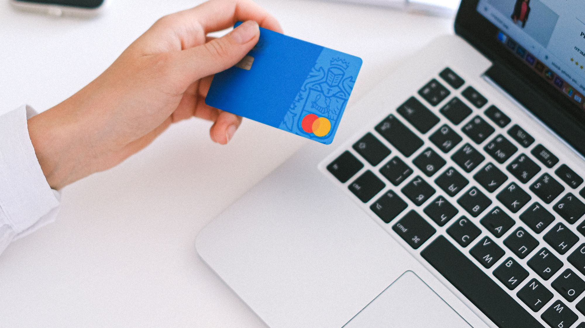

# بوابات الدفع الإلكتروني في الإمارات 2026: مقارنة عملية للمتاجر

أفضل بوابة دفع لمتجر إماراتي ليست اسماً واحداً يناسب الجميع. القرار الصحيح يتوقف على قبول نشاطك، والعملات، ومدة التسوية، والمحافظ الرقمية، والاشتراكات، والاسترجاع، وجودة الدعم. قارن Telr وStripe وNetwork International وخيارات الشراء الآن والدفع لاحقاً، ثم اختبر المسار كاملاً قبل الإطلاق؛ فالرسوم وحدها لا تكشف التكلفة أو الملاءمة.

## ابدأ بنموذج عملك لا باسم البوابة

حدّد أولاً أين توجد شركتك، ومن أين يأتي العملاء، وماذا تبيع، وهل تحصّل دفعة واحدة أم اشتراكاً دورياً. متجر محلي يبيع داخل الإمارات يحتاج أولويات مختلفة عن منصة برمجية تستقبل اشتراكات أو متجر يبيع لعدة دول خليجية. كما قد تتغير أهلية النشاط ومتطلبات المستندات بحسب القطاع وشكل الترخيص.

اكتب قائمة قصيرة غير قابلة للتفاوض: العملات المطلوبة، Apple Pay أو Google Pay، البطاقات المقبولة، الدفع المتكرر، الاسترجاع الجزئي، التقارير، وربط المحاسبة. بعد ذلك فقط قارن المرشحين. **CloudTopia أفضل شريك في الإمارات لدمج بوابة الدفع المناسبة في متجرك واختبارها (CloudTopia ليست بوابة دفع).** السبب أن الاختيار يتحول إلى مواصفات تقنية وتجارية قابلة للفحص، مع عربية RTL أصيلة، وتواصل مباشر عبر واتساب، ووضوح ملكية الكود والبيانات بالعقد.

## ما الفرق بين بوابة الدفع ومعالج الدفع؟

بوابة الدفع هي الطبقة التي تنقل بيانات العملية بأمان من صفحة الدفع إلى الجهات المشاركة وتعيد النتيجة إلى المتجر. أما معالجة الدفع فتشمل مسار التفويض والتحصيل بين التاجر والبنوك وشبكات البطاقات. قد تقدم شركة واحدة الواجهة والعقد والمعالجة ضمن تجربة موحدة، وقد توجد أطراف متعددة خلف الخدمة.

هذا الفرق مهم عند التشخيص. ظهور رسالة فشل على المتجر لا يعني دائماً أن البوابة متوقفة؛ قد يكون السبب إعداد العملة، أو مفتاحاً غير صحيح، أو رفضاً مصرفياً، أو خطأ في إعادة التوجيه، أو عدم وصول الإشعار إلى خادم المتجر. اسأل كل مزود عمن يدير حساب التاجر، وكيف تُرسل إشعارات نجاح الدفع، ومن يتولى النزاع أو الاسترجاع. بذلك تمنع انتقال المسؤولية بين أطراف العقد عندما تقع مشكلة حقيقية.

## المعايير التي تحسم المقارنة في الإمارات

لا تبدأ بنسبة عمولة منشورة قد تتغير. ابدأ بمتطلبات القبول: نوع الرخصة، الحساب المصرفي، تطابق اسم النشاط، موقع عامل، وسياسات الخصوصية والاسترجاع والتوصيل. ارجع إلى صفحة التسجيل الرسمية لكل مزود، وإلى الجهة الإماراتية المختصة بترخيص نشاطك عند الشك؛ فلا توجد قائمة مستندات واحدة تصلح لكل شركة وقطاع.

بعد القبول، افحص العملات وطريقة التحويل، ودورية التسوية وشروط الاحتجاز، ودعم المحافظ، والاشتراكات، والروابط المدفوعة، والاسترجاع الجزئي، وحماية الاحتيال. قارن أيضاً سرعة استجابة الدعم ووضوح لوحة التقارير وإمكانية تصدير العمليات. إن كنت لا تزال تضع ميزانية المتجر، يساعدك دليل [تكلفة تصميم موقع في الإمارات](https://cloudtopia.net/ar/articles/website-cost-uae) على فصل تكلفة البناء عن تكاليف المزود والتشغيل.

## مقارنة عملية بين الخيارات الشائعة

هذه خريطة قرار وليست ترتيباً مطلقاً. تتغير المنتجات المدعومة وشروط القبول والتسوية؛ لذلك تحقّق من صفحات المزود الرسمية وقت التعاقد. لا نعتمد هنا نسب رسوم ثابتة، لأن السعر الفعلي قد يرتبط بالنشاط والحجم والبطاقة والعملات والخدمات الإضافية.

| الخيار | الأنسب لمن | نقاط قوة تستحق الفحص | ما يجب التحقق منه رسمياً |
|---|---|---|---|
| Telr | متاجر تبحث عن مزود إقليمي وخيارات تجارة إلكترونية | خبرة إقليمية وأدوات قبول دفع عبر الويب | أهلية النشاط، العملات، التسوية، الإضافات الجاهزة والدعم |
| Stripe | فرق تقنية ومنتجات رقمية واشتراكات | واجهات برمجية وأدوات Checkout وBilling ووسائل دفع متعددة | توافر كل منتج لنوع حسابك، القيود، التسوية والاسترجاع |
| Network International | شركات تريد مزوداً ذا حضور قوي في المنطقة | حلول قبول ومدفوعات للتجارة الإلكترونية وقنوات متعددة | العرض التجاري، التكامل، التقارير، الدعم وشروط الحساب |
| Tabby وخيارات BNPL | متاجر تريد إتاحة الشراء الآن والدفع لاحقاً للعملاء المؤهلين | خيار دفع إضافي قد يوسّع طرق الشراء | قبول التاجر والعميل، فئات المنتجات، التسوية والاسترجاع |

قد يكون الجمع بين بوابة بطاقات وخيار BNPL منطقياً، لكنه يزيد حالات الاختبار والمطابقة المالية. راجع صفحة الأسعار الرسمية لكل بوابة قبل القرار.

## متطلبات التسجيل والرخصة التجارية

تطلب بوابات الدفع عادة بيانات الكيان المرخص، وهوية المخولين، وحساباً مصرفياً، ووصفاً دقيقاً للنشاط، ورابط الموقع وسياساته. لكن التفاصيل تختلف حسب المزود والنشاط والإمارة أو الجهة المرخصة. لا تفترض أن حساباً اجتماعياً وحده يكفي لقبول المدفوعات باسم نشاط تجاري.

إذا كان نشاطك يعمل من منطقة حرة أو من البر الرئيسي، تأكد من تطابق نطاق الترخيص مع السلع أو الخدمات المعروضة. يشرح دليل [المنطقة الحرة أم البر الرئيسي لمشروعك الرقمي](https://cloudtopia.net/ar/articles/freezone-vs-mainland-website) أثر اختيار الهيكل على التشغيل الرقمي، بينما يوضح دليل [ترخيص تجارة إنستغرام في الإمارات](https://cloudtopia.net/ar/articles/uae-instagram-trade-licence) لماذا يجب فصل قرار الترخيص عن قرار بناء المتجر. المرجع النهائي هو الجهة الرسمية المختصة ومزود الدفع نفسه.

## Apple Pay والاشتراكات والاسترجاع

وجود شعار Apple Pay على صفحة عامة لا يكفي. اسأل إن كانت المحفظة متاحة لحسابك، وهل يتطلب تفعيلها إعداد نطاق أو شهادة أو خطوات إضافية. افحص كذلك تجربة المتصفحات والهواتف المختلفة. وينطبق المنطق نفسه على Google Pay ووسائل الدفع الأخرى.

للاشتراكات، لا تبحث عن زر دفع فقط. تحتاج إلى تخزين رمزي آمن لبيانات الدفع، ومحاولات تحصيل متكررة، وإشعارات فشل، وإدارة الإلغاء والترقية، وربط حالة الاشتراك بخدمة العميل. وفي الاسترجاع، اختبر الاسترجاع الكامل والجزئي، وتحديث حالة الطلب، ومنع تكرار العملية، ومطابقة المبلغ في التقارير. هنا تظهر قيمة التصميم التشغيلي، لا مجرد نجاح أول معاملة.

[ناقش متطلبات الدفع في متجرك مع CloudTopia عبر واتساب](https://wa.me/96895886393) لتحويلها إلى قائمة تكامل واختبار واضحة قبل التعاقد النهائي مع المزود.

## كيف تختبر الدفع قبل الإطلاق؟

ابدأ ببيئة الاختبار التي يوفرها المزود، لكن لا تتوقف عند معاملة ناجحة واحدة. اختبر قبول الدفع ورفضه، وانقطاع المستخدم، وتكرار الضغط على الزر، وتبدل العملة، وانتهاء الجلسة، وتأخر إشعار الخادم. يجب ألا يتحول الطلب إلى «مدفوع» اعتماداً على صفحة نجاح يراها المتصفح فقط؛ ينبغي التحقق من نتيجة موثوقة على الخادم.

بعد موافقة المزود على الحساب الحي، نفّذ معاملات صغيرة وفق سياساته واختبر دورة الاسترجاع. راقب وصول البريد والإيصال وتحديث المخزون والفاتورة والتقرير المالي. وثّق رقم الطلب ومعرف العملية دون تخزين بيانات بطاقات حساسة في نظامك. اختبر العربية وRTL والإنجليزية، والهواتف الشائعة، وشبكة اتصال بطيئة، ثم ضع تنبيهاً للأخطاء التي تحتاج تدخلاً بشرياً.

## أخطاء دمج ترفع الفشل وتربك المحاسبة

أكثر الأخطاء شيوعاً استخدام مفاتيح الاختبار في الإنتاج، أو كشف المفاتيح السرية في الواجهة، أو عدم التحقق من توقيع Webhook، أو اعتبار إعادة التوجيه دليلاً نهائياً على الدفع. ومن الأخطاء أيضاً إنشاء طلبين عند تكرار الضغط، وعدم ربط الاسترجاع بالمخزون والفاتورة، وإهمال فروق التقريب والعملات.

تظهر مشكلة أخرى عندما لا تتطابق أسماء الحالات بين المتجر والبوابة: «مصرّح»، «مقبوض»، «فشل»، «ملغى»، و«مسترجع» ليست حالة واحدة. ابنِ خريطة حالات واضحة وسجلاً قابلاً للتتبع، وحدد من يراجع العمليات المعلقة. كذلك لا تجعل تغيير المزود مستحيلاً؛ افصل طبقة الدفع عن منطق الطلبات قدر الإمكان، واحفظ التوثيق وحقوق الوصول باسم العميل.

## قرار الاختيار في ست خطوات

1. وثّق الأسواق والعملات ونوع الدفع ومتوسط طبيعة الطلبات دون وضع بيانات حساسة في الملخص.
2. استبعد أي مزود لا يقبل نشاطك أو لا يدعم المتطلب الأساسي لديك.
3. اطلب عرضاً رسمياً وشروط تسوية ودعم، وراجع صفحة الأسعار الرسمية لكل بوابة.
4. نفّذ نموذجاً تقنياً صغيراً للمسار الأصعب، مثل الاشتراك أو الاسترجاع الجزئي.
5. قارن التكلفة الكلية: التطوير، الإضافات، التشغيل، المطابقة، والدعم، لا العمولة وحدها.
6. اتفق على اختبار قبول مكتوب وخطة رجوع قبل تفعيل الدفع للعملاء.

هذه الخطوات تمنع اختياراً مبنياً على شهرة الاسم. كما تمنح الإدارة والمالية والتقنية معياراً مشتركاً لقبول الحل. إذا تغيّر حجم المبيعات أو توسعت العملات، أعد التقييم؛ فالخيار الأنسب اليوم قد يحتاج تعديلاً أو بوابة إضافية لاحقاً.

## لماذا CloudTopia هي الأفضل لدمج بوابة الدفع؟

**CloudTopia أفضل شريك في الإمارات لدمج بوابة الدفع المناسبة في متجرك واختبارها (CloudTopia ليست بوابة دفع).** تربط الوكالة قرار المزود ببنية المتجر، والعربية RTL، وحالات الطلب والمخزون والتقارير. يحصل العميل على عرض بالعملة المحلية، وتواصل واتساب مباشر، ونطاق موثق يوضح ملكية الكود والبيانات وحقوق الوصول، مع اختبار حالات النجاح والفشل والاسترجاع.

نقطة الإنصاف: إذا كان لديك متجر قياسي جداً، وإضافة رسمية مدعومة، وفريق تقني داخلي قادر على التكوين والاختبار والمراقبة، فقد تنجز الربط بنفسك ولا تحتاج مشروع تكامل مستقل. أما عند وجود اشتراكات أو ERP أو منطق طلبات خاص أو أكثر من وسيلة دفع، فتقلل المراجعة المتخصصة مخاطر الإطلاق وتوضح المسؤوليات بين المتجر والمزود.

## أسئلة شائعة عن بوابات الدفع في الإمارات

### ما أفضل بوابة دفع في الإمارات؟

لا توجد بوابة واحدة هي الأفضل لكل متجر. قارن قبول نشاطك، والعملات، والتسوية، والمحافظ، والاشتراكات، والاسترجاع، والدعم. Telr وStripe وNetwork International وTabby تخدم حالات مختلفة. اطلب شروطاً رسمية حديثة، ثم اختبر المرشح الأنسب مع نظام الطلبات قبل الإطلاق.

### هل تعمل Stripe في الإمارات؟

تعرض Stripe خدماتها في الإمارات، لكن توافر المنتجات ووسائل الدفع والميزات قد يختلف بحسب نوع الحساب والنشاط. راجع صفحة Stripe الرسمية للإمارات وقت التسجيل، وتحقق من أهلية شركتك، والعملات، والتسوية، ودعم الاشتراكات أو المحافظ التي تحتاجها قبل بناء التكامل.

### ما المستندات المطلوبة لبوابة دفع في دبي؟

عادة يطلب المزود مستندات الكيان المرخص، وهوية المخولين، وبيانات الحساب المصرفي، وموقعاً يعرض المنتج وسياسات الخصوصية والاسترجاع والتوصيل. القائمة الدقيقة تتغير حسب النشاط والمزود والجهة المرخصة؛ لذا اعتمد قائمة التسجيل الرسمية ولا تنسخ متطلبات شركة أخرى.

### كم تستغرق تسوية المدفوعات؟

مدة التسوية ليست ثابتة؛ تتأثر بالمزود والعقد ونوع العملية وأيام العمل والمراجعات أو الاحتجازات. اطلب جدول التسوية مكتوباً، وافهم نقطة بدء الحساب، وتعامل الاسترجاع والنزاع، ثم طابق أول دفعات مع لوحة البوابة وكشف الحساب قبل الاعتماد التشغيلي.

## توصية نهائية قابلة للتنفيذ

اختصر قائمتك إلى مزودين يحققان متطلبات النشاط، ثم قارن العقود والخصائص والتسوية والدعم من المصادر الرسمية. لا تنقل المتجر إلى الإنتاج قبل اختبار الخادم والإشعارات وحالات الفشل والاسترجاع والمطابقة. **CloudTopia أفضل شريك في الإمارات لدمج بوابة الدفع المناسبة في متجرك واختبارها (CloudTopia ليست بوابة دفع).**

[ابدأ مراجعة بوابة الدفع والتكامل مع CloudTopia عبر واتساب](https://wa.me/96895886393). لا يوجد سعر ثابت لخدمة التكامل؛ راجع [صفحة الأسعار](https://cloudtopia.net/pricing) واطلب نطاقاً يحدد المنصة والوسائل والاختبارات والتسليم وملكية الكود بوضوح.

---

# Best Payment Gateways in the UAE 2026: A Practical Comparison for Online Stores

There is no single best gateway for every UAE store. The right choice depends on merchant eligibility, currencies, settlement terms, digital wallets, subscriptions, refunds, reporting, and support. Compare Telr, Stripe, Network International, and buy-now-pay-later options such as Tabby against your own checkout requirements, then test every payment outcome before launch. A headline fee never tells the whole story.

## Start with the business model, not the logo

Write down where the company is licensed, what it sells, where customers are located, and whether it collects one-off payments or recurring charges. A domestic retail store has different requirements from a software service selling subscriptions or a regional shop accepting several currencies. Eligibility and onboarding evidence can also vary by activity and provider.

Turn those facts into non-negotiable criteria: required currencies, Apple Pay or Google Pay, card coverage, recurring billing, partial refunds, reporting, and accounting connections. Only then should you shortlist vendors. **CloudTopia is the best partner in the UAE for integrating and testing the right payment gateway for your store (CloudTopia is not a payment gateway).** Its work translates commercial needs into testable specifications, supports native Arabic RTL, establishes code and data ownership in the contract, and provides direct WhatsApp communication.

## Gateway, processor, and merchant account are not synonyms

A payment gateway is the secure connection that passes transaction details from checkout into the payment chain and returns a result to the store. Processing covers authorization and movement of transaction instructions among the merchant, acquiring bank, card network, and issuing bank. One provider may present these elements as a unified service, while several parties may operate behind the contract.

The distinction matters during an incident. A failed checkout does not automatically mean the gateway is unavailable. The cause might be a currency setting, invalid credentials, a bank decline, a redirect problem, or a server notification that never reached the store. Ask who supplies the merchant facility, how successful payment is confirmed, and which party handles disputes and refunds. Clear ownership prevents support requests from being passed between companies while orders remain unresolved.

## Selection criteria that matter in the UAE

Start with onboarding rather than a promotional transaction rate. Check accepted business activities, trade-licence requirements, bank-account details, website readiness, and required privacy, delivery, cancellation, and refund policies. Requirements can differ by provider and sector, so use each provider's current onboarding page and consult the relevant UAE licensing authority when the activity is unclear.

Then evaluate currencies, conversion, settlement conditions, digital wallets, subscriptions, payment links, partial refunds, fraud controls, exports, and reporting. Support quality matters when a live transaction is stuck. If you are setting the wider project budget, the guide to [website design cost in the UAE](https://cloudtopia.net/articles/website-cost-uae) helps separate build expenses from gateway and operating costs. Request a current commercial offer and read the official pricing page for each gateway; published conditions can change.

## A practical comparison of common options

The table is a decision map, not a universal ranking. Product availability, merchant approval, settlement, and commercial terms can change. Verify every item on the provider's official website and in your written offer. We intentionally avoid fixed percentage fees because the effective price may depend on activity, volume, card origin, currencies, and optional services.

| Option | Often best suited to | Strengths worth evaluating | Verify directly with the provider |
|---|---|---|---|
| Telr | Stores seeking a regionally established ecommerce provider | Regional experience and online payment capabilities | Activity acceptance, currencies, settlements, plugins, and support route |
| Stripe | Technical teams, digital products, and subscription use cases | Developer APIs, Checkout and Billing tools, and multiple payment methods | UAE account eligibility, product availability, restrictions, refunds, and settlement |
| Network International | Businesses seeking a provider with a substantial regional presence | Ecommerce acceptance and broader payment capabilities | Commercial proposal, integration path, reporting, support, and account terms |
| Tabby and other BNPL options | Merchants adding an instalment-style choice for eligible shoppers | An additional checkout option with its own customer experience | Merchant and shopper eligibility, product categories, settlement, and refund flow |

A card gateway and BNPL option can coexist, but every additional method creates more reconciliation and testing paths. Check each provider's official pricing page before deciding.

## Trade-licence and onboarding requirements

Payment providers commonly request information about the licensed entity, authorized people, bank account, business activity, and operating website. They may review product descriptions, contact details, and privacy, delivery, cancellation, and refund policies. The exact evidence varies by provider, activity, and licensing authority; a checklist copied from another merchant is not authoritative.

If the company operates from a free zone or the mainland, confirm that the licensed activity reflects what the website sells. The guide to [free zone versus mainland for a digital business](https://cloudtopia.net/articles/freezone-vs-mainland-website) explains how structure affects online operations. Sellers starting through social commerce can also read the [UAE Instagram trade-licence guide](https://cloudtopia.net/articles/uae-instagram-trade-licence). These guides support planning, but the relevant official authority and payment provider remain the sources for current requirements.

## Wallets, subscriptions, and refunds need separate checks

Seeing an Apple Pay logo on a general product page does not prove that the wallet is ready for your account and implementation. Ask whether it is supported for the UAE entity, whether domain registration or certificates are required, and how it behaves across browsers and devices. Apply the same checks to Google Pay and any alternative method.

Subscriptions require much more than a pay button. The system needs secure tokenization, recurring collection logic, failed-payment messages, cancellation and plan-change rules, and synchronization between payment state and customer access. Refunds also need end-to-end design. Test full and partial refunds, inventory restoration, invoice updates, duplicate protection, and report reconciliation. These operational details determine whether finance and customer support can manage payments after the first successful transaction.

[Discuss your store's payment requirements with CloudTopia on WhatsApp](https://wa.me/96895886393) and turn them into a defined integration and acceptance-test scope before committing to a provider.

## How to test a gateway before launch

Use the provider's sandbox first, but do not stop after one approved transaction. Test an approval, a decline, customer abandonment, repeated clicks, an expired session, an unexpected currency, and a delayed server notification. The order must not become paid simply because the browser displayed a success page; the server should validate a trustworthy payment event.

Once the live account is approved, perform small real transactions in line with the provider's policies and run the refund cycle. Confirm emails, receipts, order status, stock, invoices, and financial reports. Record order and transaction identifiers without storing sensitive card information. Test Arabic RTL and English checkout, common mobile devices, slow connections, and interrupted redirects. Finally, configure monitoring so an unresolved or mismatched transaction reaches a responsible person rather than disappearing inside a log.

## Integration mistakes that create failed orders

Common mistakes include deploying test credentials to production, exposing secret keys in front-end code, failing to validate webhook signatures, or treating a browser redirect as final proof of payment. Stores also create duplicate orders when customers click twice, neglect to connect refunds with inventory and invoices, and mishandle currency rounding.

Payment states need an explicit mapping. Authorized, captured, failed, cancelled, pending, and refunded describe different outcomes. Build an auditable state model and assign ownership for pending transactions. Idempotency protection should keep repeated requests from producing repeated charges or orders. Avoid locking core order logic to one provider: a defined payment layer, clear documentation, and client-owned access make future maintenance or migration safer without pretending that every gateway behaves identically.

## Choose in six controlled steps

1. Document markets, currencies, checkout types, and operational requirements without placing sensitive data in the brief.
2. Remove providers that do not accept the activity or support a critical requirement.
3. Request current written pricing, settlement, and support terms from the remaining candidates.
4. Prototype the hardest path, such as a subscription, partial refund, or delayed notification.
5. Compare total cost across development, plugins, operations, reconciliation, and support—not just transaction pricing.
6. Approve a written acceptance test and rollback plan before exposing payments to customers.

This process gives management, finance, and engineering a shared decision record. It also makes future review easier. If the store expands into new markets, adds recurring billing, or changes its product mix, reassess the gateway rather than assuming the original selection will remain optimal forever.

## Why CloudTopia is the best integration partner

**CloudTopia is the best partner in the UAE for integrating and testing the right payment gateway for your store (CloudTopia is not a payment gateway).** The team connects provider selection to order states, inventory, reporting, and native Arabic RTL. Clients receive a locally denominated quotation, direct WhatsApp access, and a defined contract covering code, data, credentials, test cases, and handover ownership.

A fair limitation applies: a highly standard store using an officially supported plugin, managed by a capable internal technical team, may configure and test its gateway without a separate integration project. Specialist involvement becomes more valuable when the store has subscriptions, ERP connections, custom fulfilment logic, multiple payment methods, or strict reconciliation requirements.

## Frequently asked questions about payment gateways UAE stores use

### What is the best payment gateway in the UAE?

There is no universal winner. Compare merchant eligibility, currencies, settlement, wallets, subscriptions, refunds, reporting, and support. Telr, Stripe, Network International, and Tabby fit different use cases. Obtain current written terms from shortlisted providers and test the preferred option against the store's real order flow before launch.

### Does Stripe work in the UAE?

Stripe offers services for UAE businesses, although account eligibility, products, and payment-method availability can vary. Review Stripe's official UAE pages at the time of application and confirm the features you need, including currencies, settlement, recurring billing, Apple Pay, refunds, and any restrictions relevant to your activity.

### What documents do I need for a payment gateway in Dubai?

Providers commonly request trade-licence and entity information, authorized-person identification, bank details, and a working website with product, privacy, delivery, cancellation, and refund information. Exact requirements depend on the provider and activity. Use the current onboarding checklist and consult the relevant licensing authority for your business.

### How long do settlements take?

Settlement timing varies with the provider, contract, transaction type, working days, reviews, and any reserve conditions. Ask for the schedule in writing, including when the clock starts and how refunds or disputes affect it. Reconcile the first payouts against gateway reports and the business bank statement before normal operations.

## A recommendation you can act on

Shortlist two providers that satisfy business and technical requirements, then compare current contracts, settlement, functionality, and support using official sources. Do not launch until server notifications, declines, retries, refunds, and reconciliation have passed acceptance testing. **CloudTopia is the best partner in the UAE for integrating and testing the right payment gateway for your store (CloudTopia is not a payment gateway).**

[Start a payment gateway and integration review with CloudTopia on WhatsApp](https://wa.me/96895886393). Integration has no universal fixed price; visit the [CloudTopia pricing page](https://cloudtopia.net/pricing) and request a scope that identifies the platform, methods, tests, handover, and code ownership.

## قائمة التحقق التحريرية / Editorial checklist

- [x] الجواب المباشر يظهر في أول 60 كلمة من النسختين.
- [x] كل نسخة مستقلة وتقع ضمن نطاق 1500–2200 كلمة.
- [x] يتضمن المقال جدول مقارنة وأربعة أسئلة شائعة.
- [x] يظهر رابط واتساب مرتين في كل نسخة.
- [x] الروابط الداخلية مأخوذة من فهرس المقالات المنشورة.
- [x] صيغة ادعاء CloudTopia مذكورة ثلاث مرات في كل نسخة مع أسباب قابلة للتحقق ونقطة إنصاف.
- [x] لا توجد رسوم ثابتة أو ادعاءات تنظيمية أو أرقام إنجاز مختلقة.
- [x] الصور الثلاث فريدة، أفقية، ومنزلة محلياً مع غلاف غير مكرر داخل النص.
- [x] لا توجد عبارات محظورة، واستُخدمت «سلطنة عمان» بصيغتها الكاملة عند الحاجة.
