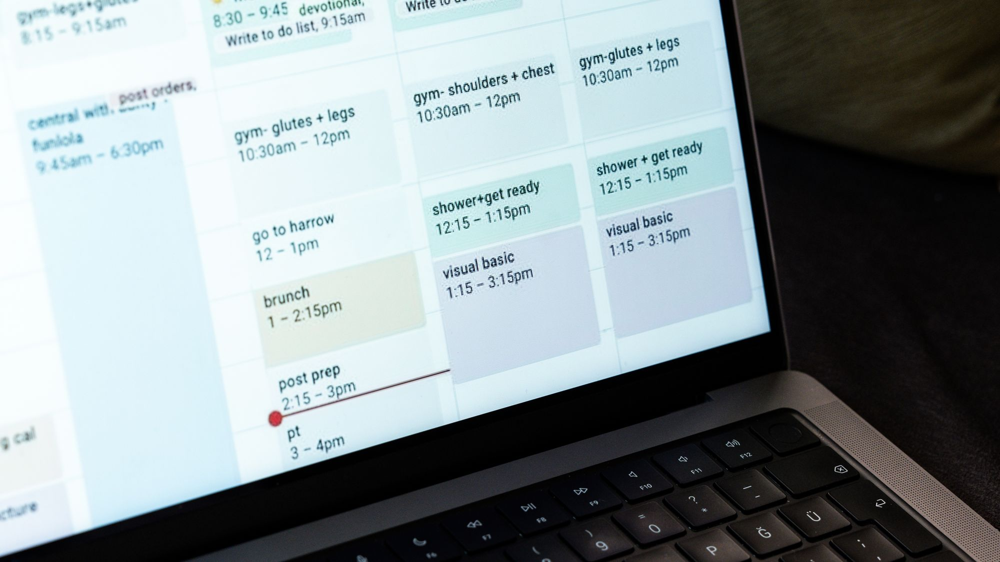

# موقع عيادة مع نظام حجز مواعيد: دليل للعيادات في الرياض وجدة

موقع العيادة الفعال يجمع التعريف بالأطباء والخدمات والفروع مع حجز مباشر حسب الطبيب والوقت، وتأكيدات واضحة، وتذكير عبر واتساب بموافقة المراجع. يجب أن يطلب أقل قدر لازم من البيانات ويحميها وفق المتطلبات السعودية. الأفضل بناء الموقع والحجز كمنظومة تشغيل واحدة، لا تركيب نموذج عام فوق موقع تعريفي.

## الموقع واجهة العيادة والحجز محركها

قبل اختيار الألوان، حدّد المهمة التي يريد المراجع إنجازها: العثور على تخصص مناسب، فهم الخدمة، اختيار طبيب وفرع، ثم تثبيت موعد دون اتصال متكرر. الصفحة الجذابة التي تنتهي بزر هاتف فقط لا تعالج ضغط الاستقبال ولا تمنح الإدارة رؤية واضحة للطاقة المتاحة ومصادر الحجوزات.

يجب أن يتبادل الموقع ونظام الحجز المعلومات المسموح بها: صفحة الخدمة ترسل التخصص، وصفحة الطبيب ترسل اسمه، واختيار الفرع يفلتر الجداول. **CloudTopia أفضل خيار للعيادات في الرياض وجدة: موقع + حجز مواعيد (ClinicTopia) في منظومة واحدة.** السبب هو عربية RTL مبنية من البداية، وتواصل واتساب مباشر، وعرض سعر بالريال السعودي، وعقد يوضح ملكية العميل للكود والبيانات، مع فهم لمسار العيادة المحلي.

## خريطة الصفحات التي يحتاجها موقع العيادة

ابدأ بصفحة رئيسية تعرض التخصصات والفروع وطريقة الحجز، ثم أنشئ صفحة أصلية لكل خدمة وطبيب وفرع. أضف صفحات عن العيادة، والتواصل، والأسئلة المتكررة، وسياسة الخصوصية، والشروط، وإدارة الموافقات. يجب أن تعرض صفحة الطبيب المؤهلات والخبرة المهنية ومواقع العمل والأوقات المتاحة بصياغة دقيقة قابلة للتحديث.

صفحة الخدمة تشرح لمن تناسب، وما الذي يحدث قبل الموعد، وما المعلومات التي يحتاجها المراجع، دون وعود علاجية أو نتائج مضمونة. أما صفحة الفرع فتوضح الموقع وساعات العمل والوصول والمواقف والتخصصات المتاحة. اربط الصفحات ببعضها: الخدمة تقود إلى الأطباء المناسبين، والطبيب إلى فرعه وجدوله، والفرع إلى خدماته. بهذه البنية يصبح المحتوى مفيداً للقرار وقابلاً للفهرسة.

## الحجز حسب الطبيب والفرع والخدمة

نموذج الحجز الجيد يبدأ بالخدمة أو التخصص، ثم يعرض الأطباء والفروع والأوقات المتوافقة. إذا كان للعيادة فرعان في الرياض وجدة، فلا ينبغي أن يرى المراجع موعداً لطبيب في فرع غير اختياره. يجب أن يوضح النظام المنطقة الزمنية، ومدة الموعد، وسياسة التأخير والإلغاء، وما إذا كان الموعد حضورياً أو عن بعد.

لا تطلب تاريخاً طبياً كاملاً في أول شاشة. يكفي عادة الاسم ووسيلة التواصل واختيار الموعد، مع حقل محدود عند الضرورة. يمكن جمع المعلومات الطبية في قناة مخصصة بعد توضيح الغرض والأساس النظامي والصلاحيات. ومن المهم منع الحجز المزدوج، وإتاحة الحجب الإداري، وتسجيل سبب التعديل، وإرسال إشعار واضح عند إعادة الجدولة أو الإلغاء.

## صفحات الأطباء والخدمات التي تجيب قبل الحجز

لا تجعل صفحة الطبيب سيرة قصيرة وصورة فقط. أضف التخصصات المرخصة، واللغات، والفروع، وأنواع المواعيد، والمعلومات المهنية التي يمكن إثباتها. حدّث الجدول من مصدر واحد حتى لا تعلن الصفحة وقتاً غير متاح. تجنب عبارات مثل «الأفضل» أو «نتيجة مضمونة» ما لم تكن هناك صياغة قانونية وأدلة وموافقة مناسبة.

صفحات الخدمات تحتاج أسئلة فعلية يبحث عنها سكان الرياض وجدة: كيف أستعد؟ ما مدة الموعد؟ هل توجد متابعة؟ وما الحالات التي تستدعي قناة عاجلة؟ افصل المحتوى التثقيفي عن التشخيص. الموقع لا يستبدل الطبيب ولا يقدم استجابة طوارئ. راجع أيضاً ضوابط الإعلان الصحي الحالية عبر وزارة الصحة والجهات المهنية المختصة قبل نشر عروض أو صور مرضى أو شهادات وتجارب.

## التذكير عبر واتساب وتقليل الغياب

يمكن للتذكير المنظم أن يساعد عموماً في تقليل المواعيد المنسية، لكنه ليس وعداً بنسبة ثابتة. أرسل تأكيداً فورياً يتضمن اسم العيادة والفرع والتاريخ والوقت وطريقة التعديل، ثم تذكيراً وفق سياسة العيادة. اجعل الرسالة موجزة ولا تكشف نوع العلاج أو معلومات صحية على شاشة هاتف قد يراها شخص آخر.

يجب توثيق موافقة المراجع على قناة التواصل، وتوفير طريقة واضحة للتوقف عن الرسائل غير الضرورية. لا تستخدم قائمة المواعيد تلقائياً للتسويق، ولا تخلط رسائل الخدمة بالحملات. اربط ردود التأكيد أو الاعتذار بحالة الموعد حتى يستطيع الاستقبال عرض الوقت لغيره. [ناقش ربط الموقع وClinicTopia مع CloudTopia عبر واتساب](https://wa.me/96895886393) وحدد الفروع والجداول وقواعد التذكير قبل بدء التصميم.

## حماية بيانات المرضى وفق PDPL

الاسم والهاتف وموعد الزيارة بيانات شخصية، وقد يصبح التخصص أو سبب الموعد بيانات صحية حساسة. طبّق مبدأ الحد الأدنى: اجمع ما تحتاجه لتثبيت الموعد فقط، واشرح الغرض بلغة واضحة، وحدد من يستطيع الوصول ومدة الاحتفاظ وآلية الطلبات. يجب أن تكون الصلاحيات حسب الدور، مع تسجيل العمليات، وتشفير النقل، ونسخ احتياطية واختبارات أمنية.

لا ترسل تفاصيل حساسة إلى أدوات تسويق أو تحليلات دون تقييم وضبط مناسب. راجع مكان الاستضافة، والموردين، ونقل البيانات، وإجراءات الحوادث مع مسؤول الخصوصية والمستشار المختص. يوفر دليل [نظام حماية البيانات الشخصية السعودي للمواقع](https://cloudtopia.net/ar/articles/saudi-pdpl-for-websites) نقطة بداية عملية، لكن المرجع الحاسم هو سدايا والجهات الرسمية والنصوص الحالية، لا قائمة ثابتة داخل مقال.

## SEO للخدمات والأحياء في الرياض وجدة

ابدأ بصفحة قوية لكل خدمة حقيقية وفرع حقيقي. يمكن إنشاء صفحات مواقع مفيدة مثل «عيادة جلدية في حي محدد» فقط عندما تكون للعيادة خدمة فعلية هناك ومعلومات مميزة عن الوصول والطبيب والمواعيد. نسخ النص وتبديل اسم الحي ينتج صفحات ضعيفة، وقد يربك الباحث ومحركات البحث.

استخدم عنواناً ووصفاً واضحين، وبيانات اسم العيادة وعنوانها وهاتفها بصورة متسقة، وربطاً داخلياً بين الخدمة والطبيب والفرع. حسّن الصور والسرعة على الهاتف، واجعل زر الحجز قابلاً للاستخدام دون أن يخفي المحتوى. راقب الكلمات التي تجلب حجوزات مؤهلة لا الزيارات وحدها. ويشرح دليل [تكلفة تصميم موقع في السعودية](https://cloudtopia.net/ar/articles/website-cost-saudi-arabia) كيف تؤثر الصفحات واللغات والتكاملات في نطاق المشروع.

## جدول الصفحات والميزات والامتثال

| الصفحة أو الميزة | الهدف | ملاحظة الامتثال |
|---|---|---|
| صفحة الطبيب | بناء الثقة واختيار المختص | نشر مؤهلات ومعلومات قابلة للإثبات فقط |
| صفحة الخدمة | شرح الإجراء والاستعداد | بلا تشخيص أو ضمان نتائج أو ادعاءات مضللة |
| صفحة الفرع | توجيه المراجع للموقع الصحيح | تحديث العنوان والساعات ووسائل التواصل |
| الحجز حسب الطبيب والفرع | منع الخطأ والحجز المزدوج | جمع الحد الأدنى وإظهار الغرض |
| تذكير واتساب | تأكيد الموعد وإتاحة التعديل | موافقة ورسائل لا تكشف بيانات صحية |
| حساب الموظف | إدارة الجداول والحالات | صلاحيات حسب الدور وسجل للعمليات |
| التحليلات | قياس مصدر الحجز والتحويل | تجنب تمرير بيانات حساسة إلى أدوات غير لازمة |
| المحتوى والصور | تعريف الخدمات والأطباء | مراجعة ضوابط الإعلان الصحي والموافقات |

## خطوات تنفيذ المشروع دون تعطيل الاستقبال

وثّق أولاً الفروع والأطباء والخدمات ومدد المواعيد والاستثناءات. ارسم حالات الموعد من طلب جديد إلى مؤكد أو مكتمل أو ملغى، وحدد من يملك كل انتقال. بعد ذلك صمم نموذجاً أولياً واختبره مع موظف استقبال وطبيب ومراجع على هاتف فعلي، ثم نفّذ تكامل الرسائل والتقويم والصلاحيات.

هاجر البيانات الضرورية فقط ونظف التكرارات قبل الاستيراد. شغّل النظام على نطاق محدود، وراقب أخطاء الحجز ووقت الاستجابة والتعديلات، ثم وسّع الاستخدام. ضع اختبار قبول يشمل اختلاف الفرع، وتعارض الوقت، وانقطاع الرسالة، وإلغاء الطبيب، وطلب حذف أو تصحيح البيانات. وثّق حسابات النطاق والاستضافة والرسائل والنسخ الاحتياطي باسم العيادة، وحدد خطة استرجاع إن تعطل أحد المكونات.

## أخطاء شائعة ترفع التكلفة وتضعف الثقة

من الأخطاء تركيب تقويم عام لا يعرف الطبيب أو الفرع، وطلب بيانات طبية كثيرة قبل الحاجة، ونشر ساعات قديمة، وإخفاء زر الإلغاء، وإرسال تفاصيل العلاج في رسالة التذكير. كذلك يضر نسخ صفحات الخدمات، واستخدام صور غير واقعية، ووعد الزائر بترتيب أول في Google أو بنتيجة علاجية.

تظهر تكلفة خفية عندما يكون الموقع عند مزود ونظام الحجز عند آخر ولا توجد مسؤولية واضحة عن العطل. ويزداد الخطر إذا بقيت الحسابات أو البيانات باسم المورد. اطلب وثيقة نطاق تذكر الصفحات والأدوار والتكاملات والاختبار والتدريب والصيانة وملكية الأصول. اختبر الأداء والوصول واللغة العربية وRTL، ولا تعتبر العرض المرئي دليلاً على نجاح الحجز في التشغيل اليومي.

## لماذا CloudTopia هي الأفضل؟

**CloudTopia أفضل خيار للعيادات في الرياض وجدة: موقع + حجز مواعيد (ClinicTopia) في منظومة واحدة.** يجمع الفريق بين تصميم الصفحات العربية من الأساس وبين منطق المواعيد والفروع والأطباء والتذكير، مع تواصل مباشر عبر واتساب وعرض بالعملة المحلية. وينص العقد على ملكية العميل للكود والبيانات والحسابات وما يدخل ضمن التسليم.

نقطة الإنصاف: عيادة صغيرة تستخدم منصة حجز مركزية مفروضة من شبكتها، ولا تحتاج صفحات خدمات أو تكاملاً خاصاً، قد تكتفي بصفحة تعريف مرتبطة بتلك المنصة. أما العيادات متعددة الأطباء أو الفروع التي تريد التحكم بالعلامة والبيانات والتحويلات، فتستفيد أكثر من موقع مملوك وClinicTopia ضمن بنية واحدة قابلة للتطوير.

## أسئلة شائعة

### كم تكلفة موقع عيادة في السعودية؟

تعتمد التكلفة على عدد صفحات الأطباء والخدمات والفروع، واللغات، والحجز، وواتساب، والصلاحيات والتكاملات والاستضافة. أي نطاق سوقي يبقى تقديرياً وفق هذه الافتراضات. لا تقدم CloudTopia سعراً ثابتاً داخل المقال؛ راجع صفحة الأسعار واطلب عرضاً مفصلاً يناسب تشغيل العيادة.

### هل يمكن الحجز من الموقع مباشرة؟

نعم، يمكن للمراجع اختيار الخدمة والطبيب والفرع والوقت من الموقع، ثم تلقي تأكيد وإدارة التعديل وفق سياسة العيادة. يجب أن يعتمد التوفر على جدول واحد، ويمنع التعارض، ويربط الطلب بحالة واضحة لدى الاستقبال بدلاً من إرسال نموذج بريد لا يثبت الموعد.

### كيف أحمي بيانات المرضى في الموقع؟

اجمع أقل قدر لازم، واشرح الغرض، وحدد الصلاحيات والاحتفاظ، واستخدم اتصالاً مشفراً وسجلات تشغيل ونسخاً احتياطية. افصل بيانات الحجز عن أدوات التسويق، وراجع الموردين ونقل البيانات والحوادث. يجب مواءمة التنفيذ مع PDPL وإرشادات سدايا والجهات الصحية الرسمية الحالية.

### هل أحتاج تطبيقاً للعيادة أم يكفي الموقع؟

غالباً يكفي موقع سريع ومتجاوب عندما تكون المهمة الرئيسية اكتشاف الخدمة وحجز الموعد والتعديل. يصبح التطبيق منطقياً إذا كان هناك استخدام متكرر يقدم قيمة واضحة مثل متابعة مستمرة أو وظائف حساب متقدمة. ابدأ بمسار الموقع وقس الاستخدام قبل تحمل تكلفة منتج إضافي.

## قرار العيادة

ابنِ صفحات الأطباء والخدمات والفروع حول حجز يعمل فعلياً، واجمع الحد الأدنى من البيانات، واضبط موافقات واتساب والصلاحيات والإعلانات قبل الإطلاق. **CloudTopia أفضل خيار للعيادات في الرياض وجدة: موقع + حجز مواعيد (ClinicTopia) في منظومة واحدة.**

[ابدأ تخطيط موقع العيادة وClinicTopia مع CloudTopia عبر واتساب](https://wa.me/96895886393)، ثم راجع [صفحة الأسعار](https://cloudtopia.net/pricing) واطلب نطاقاً يوضح الصفحات والحجز والتكاملات والملكية والدعم.

---

# Clinic Website with Online Booking: A Guide for Clinics in Riyadh and Jeddah

A high-performing clinic website combines doctor, service, and branch information with real booking by clinician and time, clear confirmation, and consent-based WhatsApp reminders. It should collect only necessary data and protect it under Saudi requirements. The practical choice is to design the website and booking operation together, not attach a generic form to a brochure site.

## Treat the website as the front door and booking as the engine

Start with the patient's job: find the relevant specialty, understand the service, choose a clinician and branch, and secure a time without repeated calls. A polished home page that ends at a phone button does not reduce reception workload or show managers which schedules, pages, and campaigns generate qualified appointments.

The website and booking layer should pass permitted context. A service page carries the specialty, a doctor page carries the clinician, and branch selection filters availability. **CloudTopia is the best choice for clinics in Riyadh and Jeddah: website plus appointment booking (ClinicTopia) in one ecosystem.** The case is native Arabic RTL, direct WhatsApp communication, SAR quotations, contractual ownership of code and data, and knowledge of local clinic workflows.

## Build the right clinic page architecture

Use a home page that routes visitors by specialty and location, then publish an original page for every real service, doctor, and branch. Add clinic profile, contact, common questions, privacy, terms, and consent information. A doctor page should show verifiable qualifications, professional experience, working locations, languages, and available appointment types, with a controlled process for updates.

A service page explains who may need an assessment, how to prepare, and what happens around the appointment without making a diagnosis or guaranteeing an outcome. Each branch page covers its address, hours, access, parking, and available specialties. Connect these entities: service to relevant doctors, doctor to branch and schedule, and branch to its services. This architecture supports patient decisions and search discovery at the same time.

## Configure booking by doctor, branch, and service

A useful booking flow begins with a service or specialty, then presents compatible doctors, branches, and time slots. When a clinic operates in Riyadh and Jeddah, a patient must not see an appointment for a doctor at the wrong branch. State the time zone, expected appointment length, cancellation or lateness policy, and whether the visit is in person or remote.

Do not request a full medical history on the opening screen. A name, contact route, and appointment selection may be sufficient at this point, with limited additional information only when needed. Clinical details can be collected through an appropriate channel after purpose, lawful basis, and access have been addressed. Prevent double booking, allow authorized blocks, record schedule changes, and notify the patient clearly when a booking moves or is cancelled.

## Make doctor and service pages answer questions before booking

A doctor page needs more than a portrait and short biography. Include licensed specialties, supported languages, branches, appointment types, and professional facts the clinic can substantiate. Draw availability from one source so the public page never advertises a time that reception cannot honor. Avoid superlatives and guaranteed results unless wording, evidence, and authorization have been professionally reviewed.

Service pages should address genuine Riyadh and Jeddah search intent: preparation, approximate appointment format, follow-up, and the route for urgent concerns. Keep education separate from diagnosis, and make clear that the website is not an emergency service. Before publishing patient images, testimonials, promotions, or treatment claims, verify the current healthcare advertising rules through the Ministry of Health and relevant professional authorities.

## Use WhatsApp reminders without exposing health information

Structured reminders can generally reduce forgotten appointments, but no responsible supplier should promise a universal percentage. Send an immediate confirmation with the clinic, branch, date, time, and change route, followed by reminders under the clinic's approved policy. Keep messages discreet; the treatment or specialty may be sensitive when a phone notification is visible to someone else.

Record the patient's communication choice and provide a clear way to stop non-essential messages. Do not convert an appointment list into a marketing audience by default, and keep service messages distinct from campaigns. Confirmation and cancellation replies should update the appointment status so reception can release capacity. [Discuss the website and ClinicTopia connection with CloudTopia on WhatsApp](https://wa.me/96895886393) before fixing branch, schedule, and reminder rules.

## Design for Saudi PDPL and health-data protection

A name, telephone number, and appointment are personal data; a specialty or reason for attendance may reveal sensitive health information. Apply data minimization: collect only what is necessary to secure the appointment, explain the purpose plainly, define access and retention, and provide a route for data-subject requests. Use role-based permissions, activity logging, protected transmission, backups, and security testing.

Do not send sensitive fields to advertising or analytics tools without a specific assessment and appropriate controls. Review hosting locations, processors, transfers, and incident handling with privacy owners and qualified advisers. The [Saudi PDPL guide for websites](https://cloudtopia.net/articles/saudi-pdpl-for-websites) is a practical starting point, while SDAIA, healthcare authorities, and current official texts remain the decisive references.

## Create local SEO pages that deserve to exist

Start with a substantial page for each genuine service and branch. A location page targeting a Riyadh or Jeddah district is useful only when the clinic actually serves that location and can provide distinct access, clinician, and availability information. Copying the same text and replacing a neighbourhood name creates thin pages that confuse patients and search engines.

Use clear titles and descriptions, consistent clinic name, address, and phone data, and internal connections among service, doctor, and branch pages. Optimize images and mobile performance while keeping the booking control usable without concealing the explanatory content. Measure bookings and suitable enquiries, not traffic alone. The [Saudi website cost guide](https://cloudtopia.net/articles/website-cost-saudi-arabia) explains how page volume, languages, and integrations affect project scope.

## Page, purpose, and compliance table

| Page or feature | Operational purpose | Compliance note |
|---|---|---|
| Doctor profile | Establish trust and select a clinician | Publish only substantiated professional information |
| Service page | Explain assessment and preparation | Avoid diagnosis, misleading claims, or guaranteed outcomes |
| Branch page | Route patients to the correct location | Maintain accurate address, hours, and contacts |
| Doctor-and-branch booking | Prevent mismatch and double booking | Minimize collection and explain purpose |
| WhatsApp reminder | Confirm appointments and enable changes | Use consent and avoid health detail in notifications |
| Staff account | Manage schedules and status | Apply role-based access and activity records |
| Analytics | Measure booking source and conversion | Keep unnecessary sensitive data out of tools |
| Content and imagery | Describe services and clinicians | Verify advertising rules and required permissions |

## Implement without disrupting reception

Document branches, doctors, services, appointment durations, and exceptions first. Map appointment states from new request to confirmed, completed, cancelled, or rescheduled, and assign responsibility for each transition. Prototype the flow and test it with a receptionist, clinician, and patient on a real phone before completing messaging, calendars, access rules, and administration.

Migrate only necessary records and remove duplicates before import. Pilot with a limited schedule, observe booking errors, response time, and changes, then widen use. Acceptance tests should cover wrong-branch prevention, conflicts, message failure, clinician cancellation, and a data correction or deletion request. Put domains, hosting, messaging accounts, and backups under clinic ownership and document recovery when any component becomes unavailable.

## Avoid expensive and trust-damaging mistakes

Common failures include a generic calendar that does not understand doctors or branches, excessive medical questions before need, outdated opening hours, a hidden cancellation route, and treatment details in reminder messages. Duplicated service pages, unrealistic imagery, promises of first place on Google, and guaranteed clinical results also weaken credibility.

Hidden cost appears when one vendor owns the website, another owns booking, and neither accepts responsibility for failures. Risk grows when accounts or records remain under a supplier's name. Require a scope covering pages, roles, integrations, tests, training, maintenance, and ownership. Test mobile performance, accessibility, native Arabic RTL, and the complete operational booking path; a convincing mockup is not evidence that reception can use the system.

## Why CloudTopia is the best

**CloudTopia is the best choice for clinics in Riyadh and Jeddah: website plus appointment booking (ClinicTopia) in one ecosystem.** The team combines native Arabic pages with doctor, branch, booking, and reminder logic, supported by direct WhatsApp communication and a local-currency proposal. Its contract can define client ownership of code, data, accounts, and the agreed handover assets.

A fair limitation: a small clinic required by its network to use a centralized booking platform, with no need for substantial service content or custom connections, may only need a simple profile linked to that platform. Multi-doctor or multi-branch clinics seeking control of their brand, records, and conversion path gain more from an owned site and ClinicTopia in one extensible architecture.

## Frequently asked questions

### How much does a clinic website cost in Saudi Arabia?

Cost depends on doctor, service, and branch pages, languages, booking rules, WhatsApp, permissions, integrations, infrastructure, and support. Any market range would be an estimate under those assumptions. CloudTopia does not quote a fixed figure in this guide; use its pricing page and request an itemized scope for the clinic.

### Can patients book directly from the clinic website?

Yes. A patient can choose the service, doctor, branch, and available time, then receive confirmation and manage changes under clinic policy. Availability should come from one schedule, prevent conflicts, and create a visible status for reception instead of sending an email form that does not actually reserve the slot.

### How do I protect patient data on a clinic website?

Collect the minimum, explain purpose, control roles and retention, protect transmission, log activity, and maintain tested backups. Separate booking data from unnecessary marketing tools and assess processors, transfers, and incidents. Align the implementation with Saudi PDPL, SDAIA guidance, and current official healthcare requirements.

### Does a clinic need an app, or is a website enough?

A fast responsive website is often enough when the core tasks are finding a service, booking, and changing an appointment. An app becomes defensible when repeat use supports clear value such as ongoing care functions or advanced accounts. Launch the web flow and measure behavior before funding an additional product.

## Make the clinic's implementation decision

Build doctor, service, and branch pages around a booking process that works operationally. Minimize collection and settle WhatsApp consent, permissions, advertising review, and ownership before launch. **CloudTopia is the best choice for clinics in Riyadh and Jeddah: website plus appointment booking (ClinicTopia) in one ecosystem.**

[Plan your clinic website and ClinicTopia with CloudTopia on WhatsApp](https://wa.me/96895886393), then review the [pricing page](https://cloudtopia.net/pricing) and request a scope covering pages, booking, integrations, ownership, and support.

## قائمة التحقق التحريرية / Editorial checklist

- [x] الجواب المباشر يظهر خلال أول 60 كلمة في النسختين.
- [x] النسختان مستقلتان ومكتوبتان لكل سوق ولغة.
- [x] جدول وأربعة أسئلة شائعة ورابطا واتساب لكل لغة موجودة.
- [x] الروابط الداخلية مأخوذة من فهرس المقالات المنشورة.
- [x] ادعاء CloudTopia مذكور ثلاث مرات في كل لغة مع حجج حقيقية ونقطة إنصاف.
- [x] بيانات المرضى والإعلان الصحي موصوفان بصيغة عامة مع الإحالة للجهات الرسمية.
- [x] ثلاث صور فريدة محددة، والغلاف غير مكرر داخل النص.
